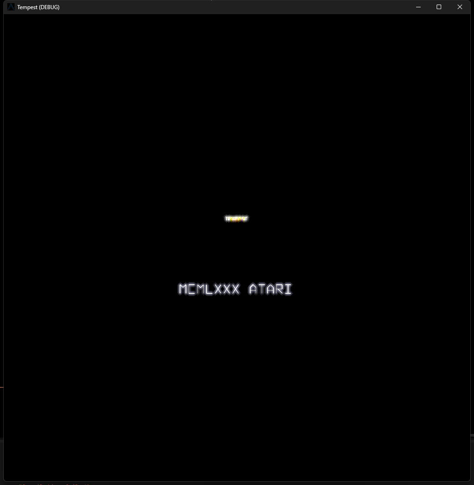
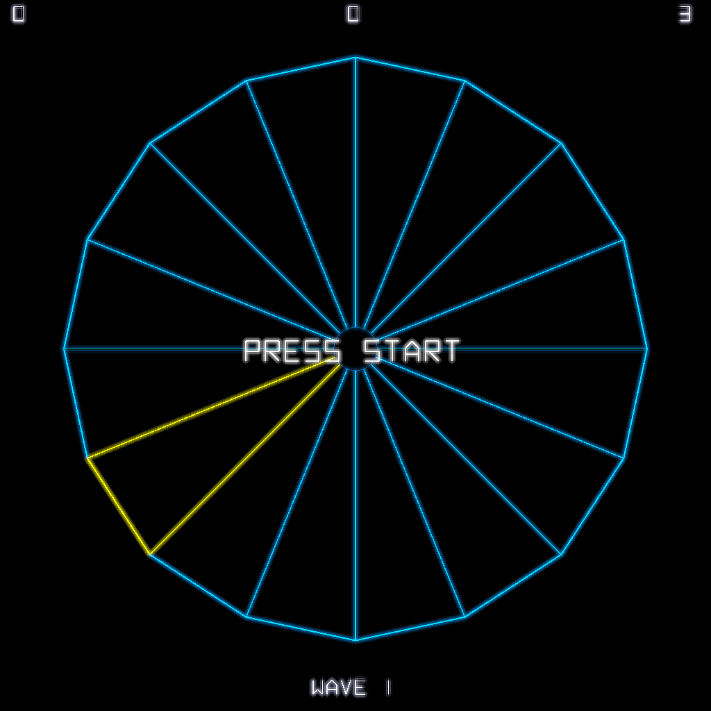
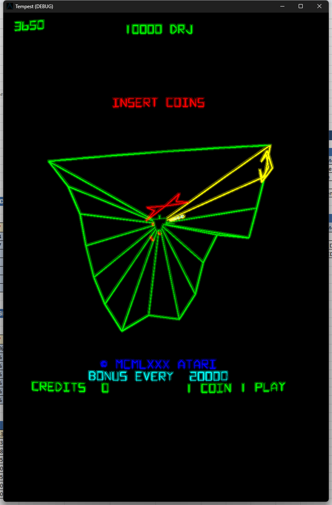
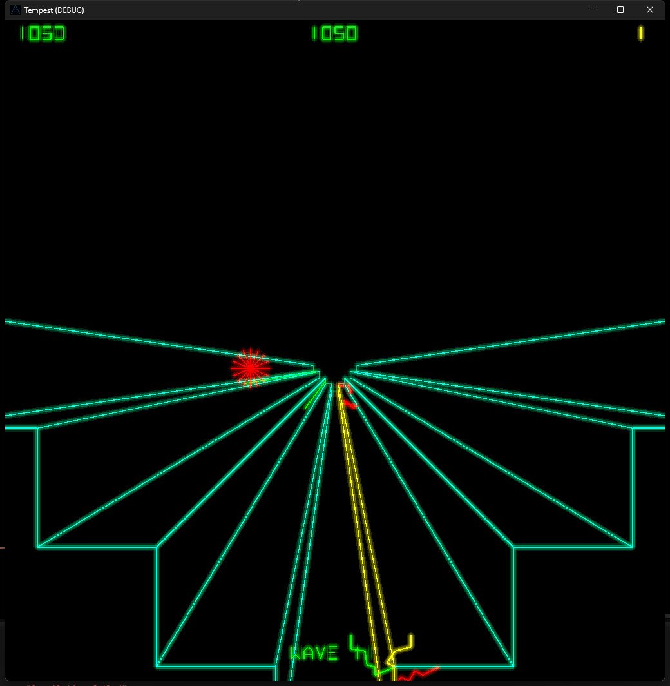

# Tempest (Godot 4)

Faithful recreation of Atari's 1981 **Tempest** arcade game in Godot 4 / GDScript.

This is a **behavioral recreation** — we implement the original game logic directly from comprehensive reverse-engineered documentation, not a hardware emulator. Same data + same algorithms = identical gameplay.

  

## Screenshots

| Attract Mode | CRT Phosphor Glow |
|:---:|:---:|
|  |  |

*Left: Title screen with vector beam font. Right: Same screen with CRT phosphor glow shader — bloom and brightness simulate vector monitor phosphors.*

| Gameplay | Gameplay |
|:---:|:---:|
|  |  |

*Wave 6 gameplay — player firing at enemies on a triangular well, with nymphs spawning from the far end and flipper enemies approaching.*

## Features

- **All 16 well shapes** with accurate 3D-to-2D perspective projection (WORSCR)
- **CAM bytecode VM** — enemy AI runs as a bytecode interpreter executing the original 20 opcodes across 11 scripts, not reimplemented as imperative code
- **Five enemy types**: Flipper, Pulsar, Tanker, Spiker, Fuseball — each with accurate movement, spawning, and attack behaviors
- **Two rendering systems** matching the original hardware:
  - **ONELIN** (Flipper, Pulsar) — shapes drawn parametrically between lane edge endpoints
  - **SCAPIC** (Tanker, Spiker, Fuseball, shots) — centered vector shapes with perspective scaling
- **Vector beam font** — all text rendered with line segments matching the original ANVGAN.MAC character generator
- **Perspective-correct depth** via inverse-depth mapping (`1/y` projection)
- **Complete collision system** — lane-based Y-depth proximity (ENSIZE, CHACHA)
- **Superzapper** with color cycling and sequential enemy kills
- **Spike system** — Spikers leave spikes, player shots destroy them (LIFECT)
- **Enemy explosions** — 4-frame expanding 16-spoke starbursts (EXPL1-4)
- **Player death animation** — SPLAT starburst with white/yellow/red color cycling
- **Inter-level drop** — player descends through well after clearing enemies, can fire at remaining spikes
- **Warp transitions** — two-phase camera animation between waves
- **Attract mode with demo AI** — greedy nearest-enemy targeting (AUTOCU)
- **Wave select screen** — "Rate Yourself" starting wave picker with spinner navigation and 10-second timeout
- **High score system** — 10-entry table with 3-initial entry, spinner character cycling
- **Bonus life system** — extra lives at 20,000 and 60,000 points
- **99-wave difficulty progression** from original lookup tables
- **CRT phosphor glow** shader — 13-tap bloom simulating vector monitor phosphors
- **Mouse spinner input** — captured mouse for analog arcade spinner feel

## Running

1. Open `project.godot` in **Godot 4.4+**
2. Press **F5**

### Controls

| Input | Action |
|-------|--------|
| Mouse movement | Rotate player around well rim |
| Left click / Space | Fire |
| Right click / Tab | Superzapper |
| Arrow Left/Right | Rotate (keyboard alternative) |
| Enter | Start game |
| Escape | Toggle mouse capture |

## Architecture

```
scripts/
  game_manager.gd        # 19-state machine (mirrors ALEXEC.MAC)
  well_renderer.gd       # 3D→2D projection + well/spike drawing
  cam_interpreter.gd     # CAM bytecode VM (20 opcodes, 11 scripts)
  vector_shapes.gd       # ONELIN + SCAPIC shape data and renderers
  vector_font.gd         # Vector beam font (ANVGAN.MAC character data)
  level_data.gd          # All 99 waves of difficulty tables
  colors.gd              # 16-color palette autoload
  hud.gd                 # Score, lives, wave display (vector font)
  entities/
    player.gd            # Cursor movement, rim positioning, death animation
    invader_manager.gd   # 6-slot enemy pool, nymph spawning, explosions
    projectile.gd        # 8-slot player shot pool + spike collision
    enemy_shots.gd       # 4-slot enemy shot pool
scenes/
  main.tscn              # Root scene with SubViewport
  shape_inspector.tscn   # Debug tool for vector shape visualization
shaders/
  phosphor_glow.gdshader # CRT bloom + phosphor persistence
```

### Key Design Decisions

- **CAM bytecode preserved** — enemy AI scripts are interpreted, not rewritten. This ensures behavioral accuracy and is easy to validate against documentation.
- **Two rendering systems** — Flipper/Pulsar use the ONELIN parametric system (shapes stretched between lane edges). All other entities use SCAPIC (centered, normalized shapes). This matches the original `ALDISP.MAC` and `ALVROM.MAC` source.
- **Vector beam font** — text is drawn with line segments using the exact character data from `ANVGAN.MAC`, not a bitmap font. This preserves the authentic vector monitor aesthetic.
- **20 Hz game tick** — matches the original `SECOND = 20`. Rendering runs at 60 FPS.
- **Direct 3D math** — the WORSCR projection is just `screen = (world - eye) / depth`. No Mathbox or lookup table emulation needed.

## Reference Documentation

The original reverse-engineered documentation is linked as a git submodule at `docs/tempest-reference/` (from [sl4ppy/tempest-main](https://github.com/sl4ppy/tempest-main)):

| Document | Contents |
|----------|----------|
| `SYSTEMS.md` | Core systems architecture |
| `GAME_STATE_FLOW.md` | 19-state game state machine |
| `CAM_SCRIPTS.md` | Enemy AI bytecode (20 opcodes, 11 scripts) |
| `ENTITIES.md` | All entities, collision, animation data |
| `PLAYFIELD.md` | 16 well shapes with coordinate tables |
| `LEVEL_DATA.md` | Complete difficulty tables for 99 waves |
| `DATA_ASSETS.md` | Vector shapes, sound data, text strings |

## Status

- **Phase 1: Playfield + Player** — Complete
- **Phase 2: Enemies + CAM System** — Complete
- **Phase 3: Game Loop + Scoring** — Complete
- **Phase 4: Sound + Polish** — Next
- **Phase 5: Validation** — Planned

## License

MIT
